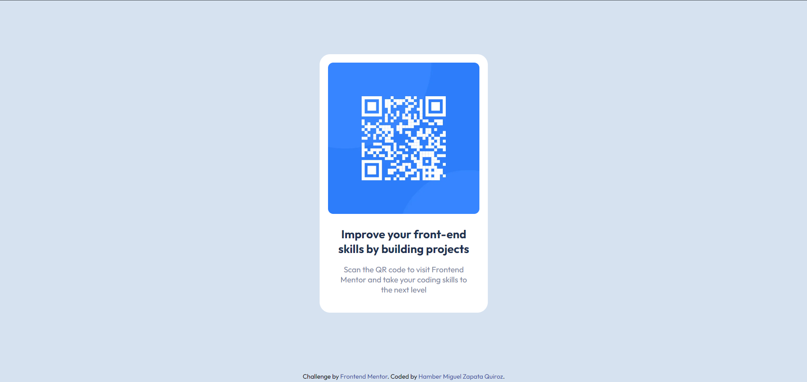

# Frontend Mentor - QR code component solution

This is a solution to the [QR code component challenge on Frontend Mentor](https://www.frontendmentor.io/challenges/qr-code-component-iux_sIO_H). Frontend Mentor challenges help you improve your coding skills by building realistic projects. 

> 💡 Important run `npm install` in your terminal to install all the dependencies and `npx gulp` if you want to change something in the sass files. 

## Table of contents

- [Overview](#overview)
  - [Screenshots](#screenshots)
  - [Links](#links)
- [My process](#my-process)
  - [Built with](#built-with)
  - [What I learned](#what-i-learned)
  - [Continued development](#continued-development)
- [Author](#author)

## Overview

### Screenshots

### Links

- Solution URL: [Add solution URL here](https://your-solution-url.com)
- Live Site URL: [Add live site URL here](https://your-live-site-url.com)

## My process

### Built with

- Semantic HTML5 markup
- CSS custom properties
- Flexbox 
- Desktop-first workflow
- [Sass](https://sass-lang.com/) - For CSS
- [Gulp](https://gulpjs.com/) 

### What I learned

I learned how to use the `gulp` task runner to compile `sass` files to `css` files and optimize images. I also learned how to use `gulp` to watch for changes in the `sass` files and automatically compile them to `css` files. 

### Continued development

I'd like in the future use grid to make the layout more responsive and to make the code more clean and organized. 
I will also implement js to my projects to make them more interactive and dynamic.

## Author

- Website - [Hamber Miguel Zapata Quiroz](https://www.your-site.com)
- Frontend Mentor - [Hamber](https://www.frontendmentor.io/profile/HzHaxx)

